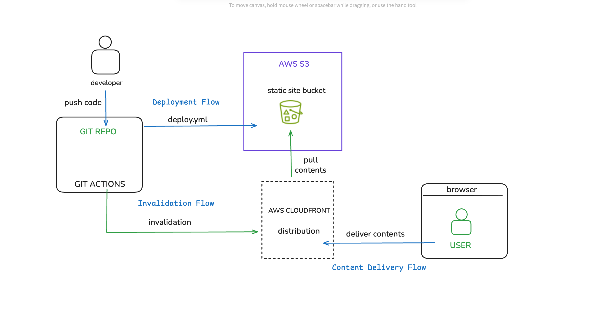

# Serverless Website Deployment Pipeline
This project demonstrates how to build a fully automated, scalable, and secure website deployment pipeline using a cloud-native, DevOps approach. 
The final product is a production-ready CI/CD workflow that automatically deploys a static website with every code change.

## The Problem

Manual deployments are slow, inconsistent, and prone to human error.
 This project solves that problem by replacing the manual process of uploading files and managing cloud configurations with an automated pipeline. 
 This allows for faster, more reliable, and more frequent software releases.

## **Technologies Used**

**AWS S3**: Used for hosting the static website files.

**AWS CloudFront**: A Content Delivery Network (CDN) used to cache and deliver the website content globally, improving performance and security.

**GitHub Actions**: The CI/CD tool used to orchestrate the entire automated pipeline.

**AWS CLI**: Used within the pipeline to perform S3 synchronization and CloudFront cache invalidation.

**AWS IAM**: Used to manage secure credentials and permissions for the pipeline.

**Git**: Used for version control and to trigger the automated workflow.

## Architecture

The project follows a simple, yet robust, cloud-native architecture.

 1. **Code Commit** : A developer commits and pushes code to a GitHub repository, which contains the *deploy.yml*  workflow file.
 2. **Pipeline Trigger:** The push action automatically triggers a **GitHub Actions** workflow.
 3. **Authentication:** The workflow uses secure **AWS IAM credentials** (stored as GitHub Secrets) to authenticate with AWS.
 4. **Content Deployment:** An AWS CLI command synchronizes the website's files to an **Amazon S3** bucket.
 5. **Cache Invalidation:** A second AWS CLI command invalidates the cache on the **Amazon CloudFront** distribution, ensuring the latest content is served.
 6. **Global Delivery:** The **CloudFront CDN** serves the updated website to global users from its edge locations.

## Key Learnings

Throughout this project, I gained hands-on experience and a deeper understanding of several core concepts:

**Infrastructure as Code (IaC) principles**: 

While I performed the initial setup manually, I learned the importance of repeatable, documented infrastructure and how services like S3 and CloudFront interconnect.

This is a great starting point. The content is all there, but it can be organized for better readability. The goal is to separate the high-level concepts from the specific technical details.

Here is a refined version you can use, organized into clear, professional sections.

---

### **Key Learnings**

I gained a deeper understanding of fundamental DevOps principles and practiced them through this project.

* **CI/CD Pipeline Design:** I learned how to build a complete, multi-step pipeline that includes source control, authentication, deployment, and crucial post-deployment steps like **cache invalidation**.
* **DevSecOps:** I practiced the **"shift-left" security model** by using **IAM** for least-privilege access and **GitHub Secrets** to securely manage credentials, which is a modern alternative to hard-coding sensitive information.
* **Cloud-Native Services:** I gained practical experience with a suite of AWS's core services and learned how they are configured to work together to create a scalable and highly available application.

---

### **AWS Services Configuration**

The project’s architecture relies on several AWS services, each configured to play a specific role.

* **Amazon S3:** The project uses an S3 bucket with **static website hosting** enabled to serve as the highly available origin for the website's files. The bucket policy was configured to allow public read access, while public access was managed and restricted at the top level to prevent unauthorized access.
* **Amazon CloudFront (CDN):** CloudFront acts as the content delivery network (CDN), caching the website's content in data centers worldwide to improve load times for users. To ensure **security**, CloudFront was configured to use an **Origin Access Identity (OAI)**, which restricts direct public access to the S3 bucket. A crucial part of the pipeline is the automated **cache invalidation** step, which tells CloudFront to clear its cached content after a new version is deployed.
